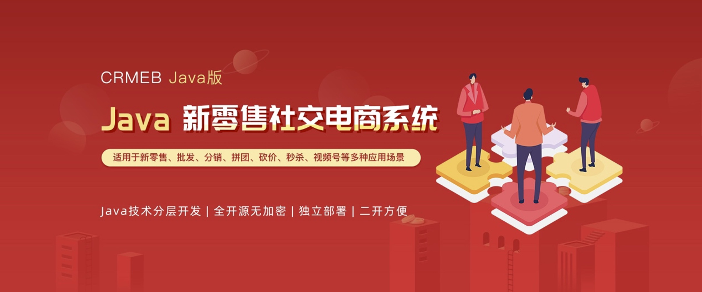

 

# **<bloder>
CRMEB开源商城系统Java版
</bloder>**

#### 
官网丨帮助文档丨技术社区丨在线体验

#### 
如果对您有帮助，您可以点右上角 "Star" ❤️ 支持一下 谢谢！

# **介绍：**
**CRMEB Java版商城系统是一款基于Java + Uni-app 开发的新零售社交电商系统，能够真正帮助企业基于微信公众号、小程序、移动端等，实现会员管理、数据分析,精准营销的电子商务管理系统。**

**系统代码全开源无加密，独立部署、二开方便，适用于企业新零售、分销、拼团、砍价，秒杀等各种业务需求。**

# **系统亮点：**
1:有详细的代码注释，有完整系统手册。 
2:基于 SpringBoot 框架开发业界主流。 
3:【前端】Web PC 管理端 vue + element UI。  
4:【前端】移动端使用 UniApp 框架，前后端分离开发。 
5:标准RESTful 接口、标准数据传输，逻辑层次更明确，更多的提高api复用。 
6:支持Redis队列，降低流量高峰，解除耦合，高可用。 
7:无缝事件机制，行为扩展更方便，方便二次开发。 
8:数据导出，方便个性化分析。 
9:数据统计分析,使用ECharts图表统计，实现用户、产品、订单、资金等统计分析。 
10:权限管理，后台多种角色，多重身份权限管理，权限可以控制到按钮级别的操作。 
11:Vue表单生成控件，拖拽配置表单，减少前端重复表单工作量，提高前端开发效率。 

# **运行环境：**
1.	移动端uniapp开发框架 可生成H5 公众号 微信小程序
2.	WEB Pc 管理后台使用Vue + Element UI 开发 兼容主流浏览器 ie11+
3.	后台服务 Java SpringBoot + Mybatis-plus + Mysql + redis
4.	运行环境 linux和windows等都支持,只要有Java环境和对应的数据库 redis
5.	运行条件 Java 1.8 Mysql5.7

# **运行环境及框架**
Java项目运行环境 
1.Java Jdk1.8 
2.Redis 5+ 
3.Mysql 5.7+ 
4.Nginx 

# **Java项目框架**
1.SpringBoot 2.2.6.RELEASE 
2.Maven 3.6.1 
3.swagger-bootstrap-ui 1.0 
4.Mybatis Plus 3.3.1 

# **WEB PC 项目运行环境**
1.npm 6 
2.node 14 
3.vue 2.x 
4.element ui 2.13 

移动端 uniapp 开发 使用 HbuilderX 开发

# **系统演示：**

移动端：https://java.crmeb.net 
WEBPC管理端：https://admin.java.crmeb.net 
账号密码： demo/crmeb.com 

## **官方论坛**
产品BUG、优化建议，欢迎社区反馈：https://www.crmeb.com/ask/thread/list/152

## **系统文档**
安装文档、产品介绍、技术文档：https://doc.crmeb.com/java/crmeb_java

## **反馈交流**
技术交流社区：https://www.crmeb.com/ask/thread/list?id=152

CRMEB JAVA 技术交流QQ群 1群 🈵️
[CRMEB JAVA 技术交流QQ群 2群 482685880 🔥](<a target="_blank" href="https://qm.qq.com/cgi-bin/qm/qr?k=Ss382XU1MITXy9B-qx15GC3G7WVaImIG&jump_from=webapi"> 点击添加群 482685880</a>)

使用中遇到bug 或者问题可以在gitee 上提 Issues
如果直接点击加群无反应可复制QQ号码手动加入
<!-- 移动端预览

功能图预览 -->

<!-- WEB PC管理端预览 -->
## **项目代码包介绍**
1:admin     WEB程序         PC端管理端 VUE + ElementUi 
2:app       移动商城         UniApp标准开发(H5 + 微信小程序) 
3:crmeb     Api            Java SpringBoot + mybatisPlus 
4:接口文档   Api对应的接口文档也可以部署项目后查看 

视频教程 B站视频教程 持续更新中

## **商业版**

购买商业版： http://crmeb.com/web/index/java 
多商户Java版：http://s.crmeb.com/goods_detail/750 

## **联系客服**

## 特别鸣谢
核心开发团队 
产品：木子刀客 
技术：❄指缝de阳光，怪兽的猫，大粽子，乡关何处 
UI：被子横盖显得高🐰 
测试：请叫我绵绵🐏 

## 使用须知
1.允许用于个人学习、毕业设计、教学案例、公益事业、商业使用; 
2.如果商用必须保留版权信息，请自觉遵守; 
3.禁止将本项目的代码和资源进行任何形式的出售，产生的一切任何后果责任由侵权者自负。 

## 版权信息
本项目包含的第三方源码和二进制文件之版权信息另行标注。 
版权所有Copyright © 2017-2022 by CRMEB (https://www.crmeb.com) 
All rights reserved。 
CRMEB® 商标和著作权所有者为西安众邦网络科技有限公司。 
