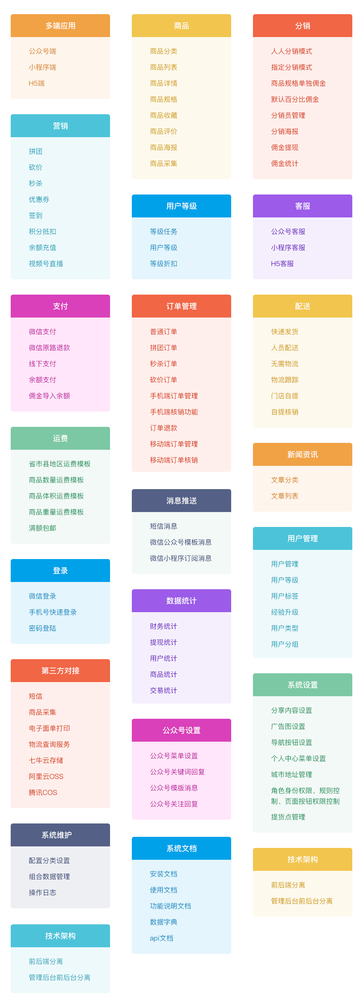
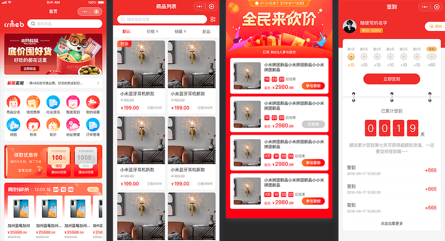
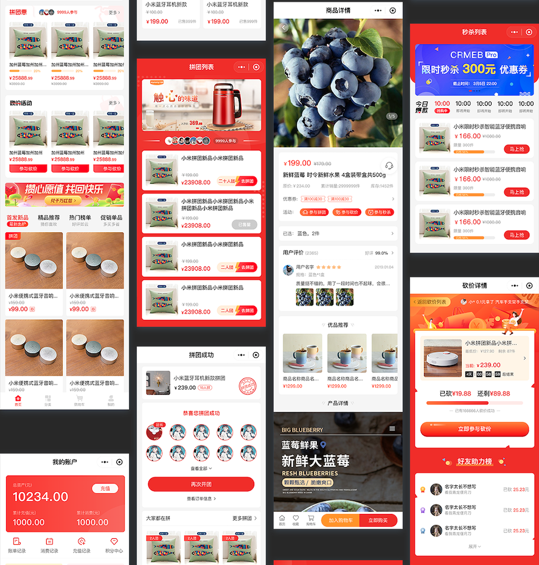
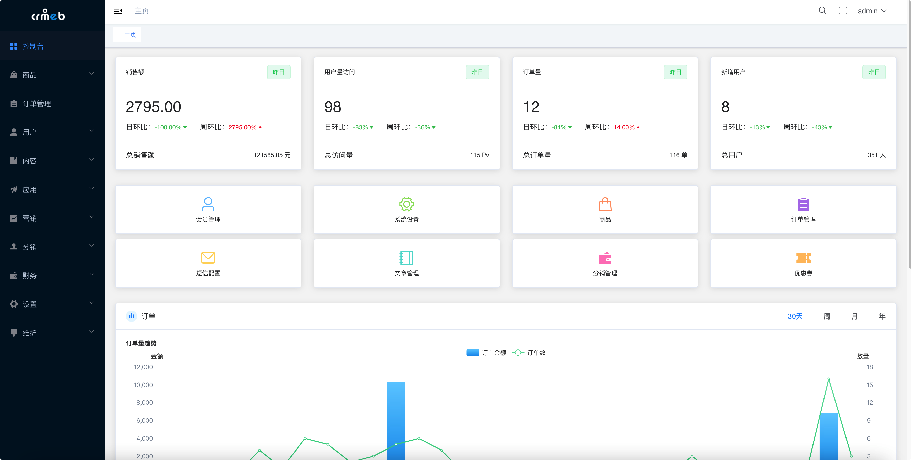
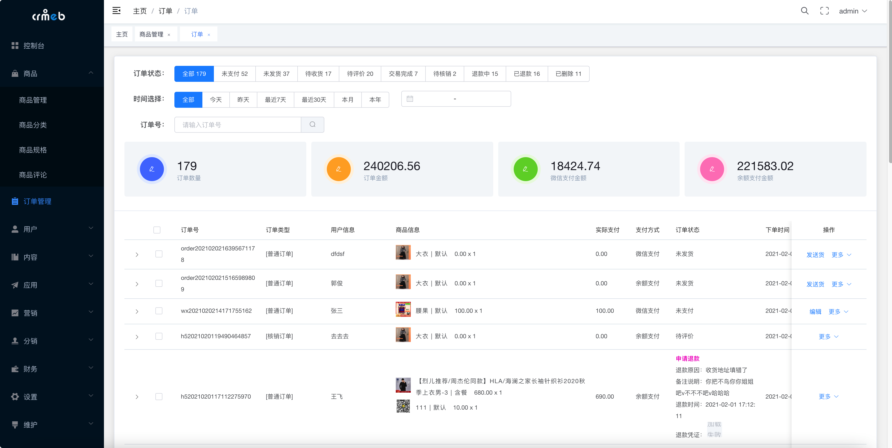
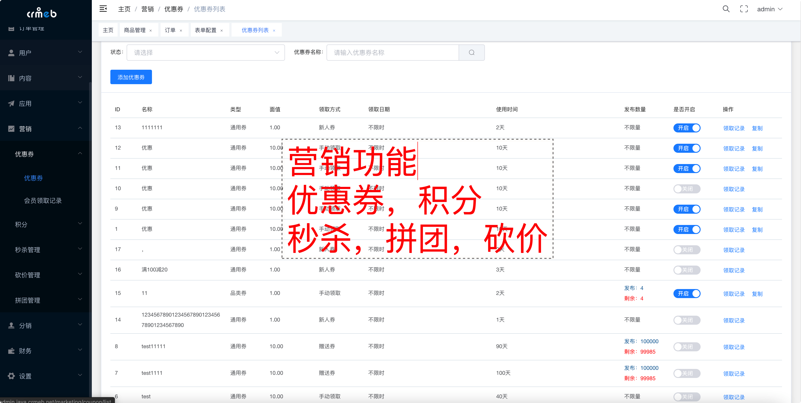
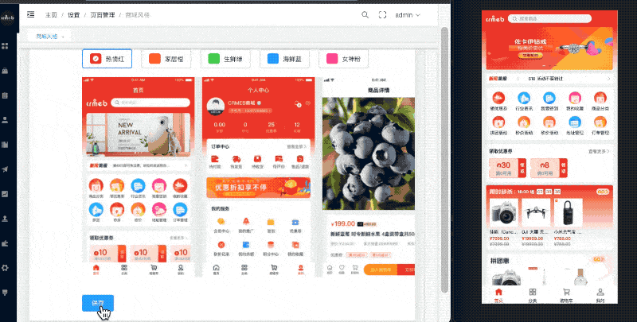
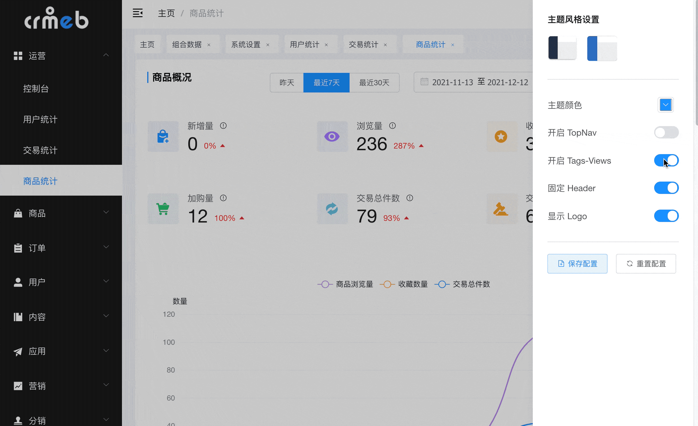

 

    

# CRMEB开源商城系统Java版

    
    <a href='https://gitee.com/ZhongBangKeJi/crmeb_java/members'>
        </img>
    </a>
   <a href='https://gitee.com/ZhongBangKeJi/crmeb_java/stargazers'>
        </img>
    </a>

[官网](https://www.crmeb.com/) |
[在线体验](https://admin.java.crmeb.net) |
[帮助文档](https://doc.crmeb.com/java/crmeb_java) |
[技术社区](https://www.crmeb.com/ask/)

[comment]: <> ([宽屏预览]&#40;https://gitee.com/ZhongBangKeJi/crmeb_java/blob/master/README.md&#41;)

    <a href="https://gitee.com/ZhongBangKeJi/crmeb_java/blob/master/README.md">宽 屏 预 览</a>

    如果对您有帮助，您可以点右上角 "Star" ❤️ 支持一下 谢谢！

---

### 📖 简介：

CRMEB 开源商城系统Java版，基于Java+Vue+Uni-app开发，在微信公众号、小程序、H5移动端都能使用，代码全开源无加密，独立部署，二开很方便，还支持免费商用，能满足企业新零售、分销推广、拼团、砍价、秒杀等多种经营需求，自用、做二开项目都很合适。

CRMEB开源商城PHP：https://gitee.com/ZhongBangKeJi/CRMEB

系统代码全开源无加密，独立部署、二开方便，适用于企业新零售、分销、拼团、砍价，秒杀等各种业务需求。

---

### 💡 系统亮点：
>1.SpringBoot 框架开发业界主流。 
>2.【前端】Web PC 管理端 Vue + Element UI。 
>3.【前端】移动端使用 Uni-app 框架，前后端分离开发。 
>4.标准RESTful 接口、标准数据传输，逻辑层次更明确，更多的提高api复用。 
>5.支持Redis队列，降低流量高峰，解除耦合，高可用。 
>6.数据导出，方便个性化分析。 
>7.数据统计分析,使用ECharts图表统计，实现用户、产品、订单、资金等统计分析。 
>8.Spring Security 权限管理，后台多种角色，多重身份权限管理，权限可以控制到按钮级别的操作。 
>9.Vue表单生成控件，拖拽配置表单，减少前端重复表单工作量，提高前端开发效率。 

---

### 💻 运行环境及框架：
~~~
1.	移动端uniapp开发框架 可生成H5 公众号 微信小程序
2.	WEB Pc 管理后台使用Vue + Element UI 开发 兼容主流浏览器 ie11+
3.	后台服务 Java SpringBoot + Mybatis-plus + Mysql + redis
4.	运行环境 linux和windows等都支持,只要有Java环境和对应的数据库 redis
5.	运行条件 Java 1.8 Mysql5.7
~~~
---

### 🔧 Java项目框架 和 WEB PC 项目运行环境
~~~
1.SpringBoot 2.2.6.RELEASE 
2.Maven 3.6.1 
3.swagger-bootstrap-ui 1.0 
4.Mybatis Plus 3.3.1 
5.npm 6 
6.node 14 
7.vue 2.x 
8.element ui 2.13 
~~~

---

### 🧭 项目代码包介绍
~~~
1. admin     WEB程序         PC端管理端 VUE + ElementUi 
2. app       移动商城         UniApp标准开发(H5 + 微信小程序) 
3. crmeb     Api            Java SpringBoot + mybatisPlus 
4. 接口文档   Api对应的接口文档也可以部署项目后查看 
~~~

移动端 uniapp 开发 使用 HbuilderX 开发

---

### 系统演示：

移动端：https://java.crmeb.net 
WEBPC管理端：https://admin.java.crmeb.net 
账号密码： demo/crmeb.com 

自己搭建演示账号
移动端 18292417675 / crmeb@123456
管理端 admin / 123456

[想了解CRMEB开源商城系统Java版整体框架，你可以戳这里快速掌握！](https://doc.crmeb.com/java/crmeb_java/2049)

---

### 系统资料
需要系统文档的朋友看过来，安装文档、产品介绍、技术文档...你想要的我都有！
[https://doc.crmeb.com/java/crmeb_java](https://doc.crmeb.com/java/crmeb_java)

要安装系统，跟着视频更顺畅！CRMEB开源商城系统Java版安装视频，给你奉上！
视频教程 B站视频教程 持续更新中 [点击观看 💻🖥️](https://www.bilibili.com/video/BV1bP4y1n76P/?vd_source=40854aeda5bba4b8766afd5a99623b16)

---

### UI界面
#### 核心功能

### 移动端预览

### WEB PC管理端预览

---
### CRMEB互动
#### 技术娱乐
代码写累了？那就歇会吧！扫码让你开心一刻！

#### 技术社区
找方法、提bug、看官方消息、拿活跃大奖！
https://www.crmeb.com/ask/thread/list/152

#### 技术交流
跟着官方，不迷路！欢迎扫码加入CRMEB 开源项目群，一手消息及资源，尽在掌握！ 
CRMEB JAVA 技术交流QQ群 1群 🈵️ 
CRMEB JAVA 技术交流QQ群 2群 🈵️ 
CRMEB JAVA 技术交流QQ群 3群 640230510 🈵️ 群已满 
CRMEB开源商城系统开发QQ频道已开启，欢迎扫码加入，一起交流学习。 

使用中遇到bug 或者问题可以在gitee 上提 Issues

---

### 特别鸣谢
核心开发团队

产品：木子刀客

技术：❄指缝de阳光，怪兽的猫，大粽子，乡关何处

UI：被子横盖显得高🐰

测试：请叫我绵绵🐏

---

### 使用须知
1.允许用于个人学习、毕业设计、教学案例、公益事业、商业使用; 
2.如果商用必须保留版权信息，请自觉遵守; 
3.禁止将本项目的代码和资源进行任何形式的出售，产生的一切任何后果责任由侵权者自负。 

---
### 版权信息
本项目包含的第三方源码和二进制文件之版权信息另行标注。 
版权所有Copyright © 2017-2022 by CRMEB (https://www.crmeb.com) 
All rights reserved。 
CRMEB® 商标和著作权所有者为西安众邦网络科技有限公司。 

---