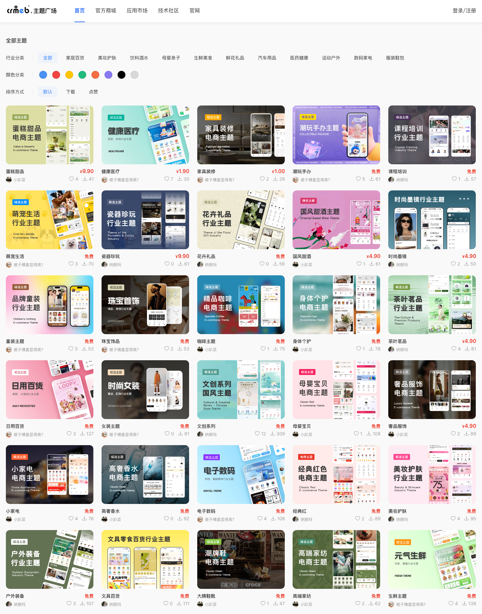
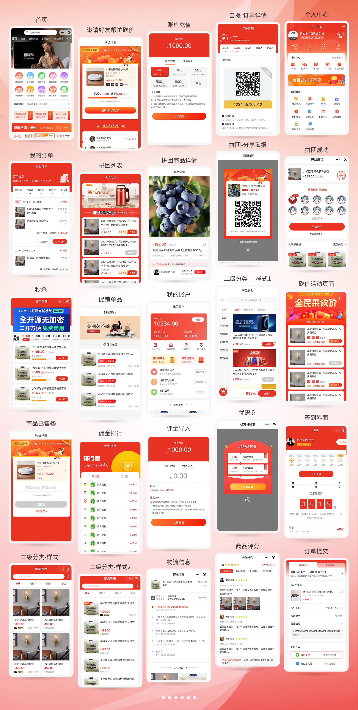
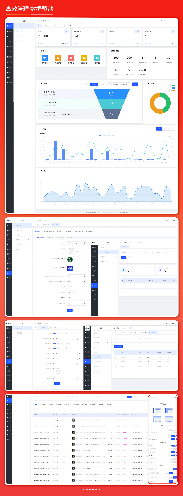
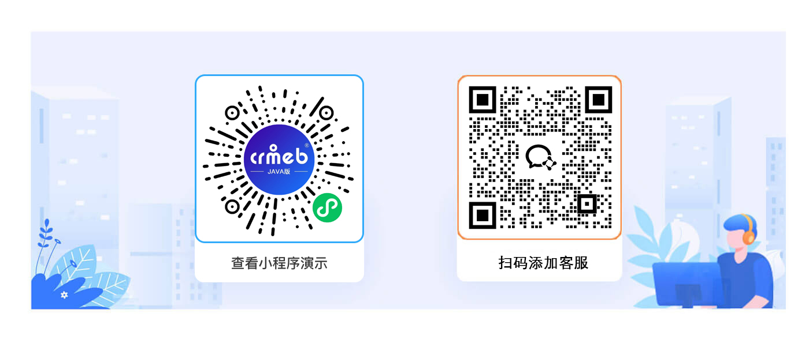
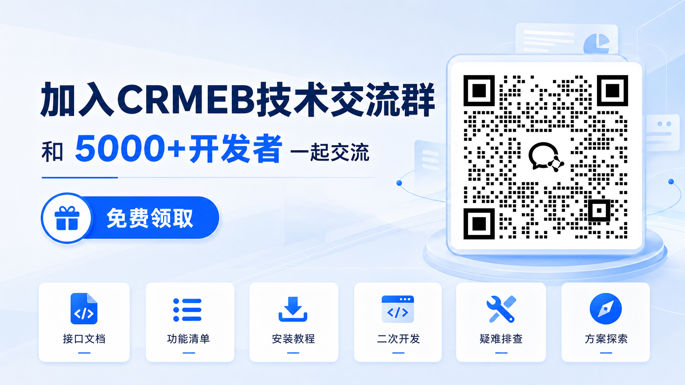
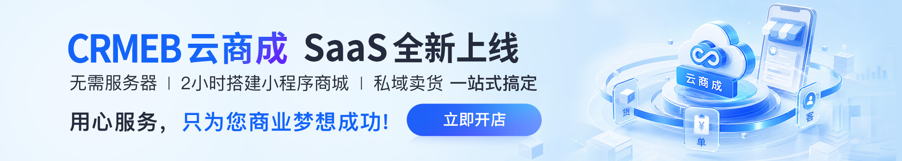

<div align="center">
    
</div>

<div align="center">

CRMEB Open Source Mall System (Java Version)

</div>

<div align="center">
    <a href="http://www.crmeb.com?from=giteejava">
        
    </a>
    <a href='https://gitee.com/ZhongBangKeJi/crmeb_java/members'>
        </img>
    </a>
    <a href='https://gitee.com/ZhongBangKeJi/crmeb_java/stargazers'>
        </img>
    </a>
</div>

<div align="center" style="font-size: 15px;">
  We are committed to open source, and your encouragement is also very important to us! Top right corner Star🌟, waiting for you to light it up
</div>

####

<div align="center">

[简体中文](./README_ZH.md)  |  English

</div>

####

<div align="center">

[Official Website](https://www.crmeb.com/?from=giteejava) |
[Online Demo](https://admin.java.crmeb.net) |
[Help Documentation](https://doc.crmeb.com/java/crmeb_java_30) |
[Technical Forum](https://www.crmeb.com/ask/thread/list/152?from=giteejava) |
[Plugin Marketplace](https://www.crmeb.com/market?from=giteephp) |
[Theme Market](https://www.crmeb.com/theme) |


</div>

---

### 📖 Project Introduction

CRMEB Open Source Mall System Java Version, a system based on Apache-An open source e-commerce solution released under the **Apache-2.0** license. The code is fully open source without encryption, can be used for free in commercial purposes, and is suitable for various enterprises and developers to quickly build a multi-terminal integrated shopping mall.

#### Technical Architecture
The system uses **Java + Vue + uni-App** technology stack is based on the SpringBoot framework, with a clear architecture design of separated front-end and back-end. Helped by uni-The app's cross-platform capabilities enable seamless realization of mini programs, official accounts, H5, APP, and PC end coverage, with unified data and synchronized business operations, greatly improving development and maintenance efficiency. At the same time, the system code is standardized and clear, with detailed comments, making secondary development very convenient.

#### Core Function

Management functions are comprehensive: Includes product management (supports SKU, attributes, categories, reviews), order management, user management, shopping cart, logistics management, financial statistics, multiple payment methods, etc.

#### Marketing tools

More than 10 marketing functions fully meet daily needs, including group buying, price cutting, flash sales, coupons, check-in, points, membership levels, balance recharge, distribution and viral marketing, event borders, atmosphere images, etc., with flexible activity rule settings.


---

### 📝 **Theme Market**

**Free Download**

Come to the CRMEB Theme Plaza to enjoy a vast selection of premium templates and create a personalized mall with zero cost. No professional design skills are required. A vast number of free templates are available for direct download and use. A variety of theme styles can accurately match the needs of different industries, quickly enhancing the store's image and user experience, allowing your mall to start strong visually from the beginning.

**One-click import**

Simplify the complex, quickly refresh the mall interface. Say goodbye to the cumbersome manual DIY configuration process of the past. With just one click to import a theme package, you can seamlessly integrate the entire theme (including page layout and global color scheme) into your system. The system automatically completes component matching and data mounting, no code needs to be written, and the preview takes effect immediately. Making the mall's renovation and upgrade as easy as changing a mobile phone wallpaper, greatly saving the time and cost of operations and development.

**Theme Square Listing**

Not only use it freely, but also earn money easily. You can leverage the system's powerful DIY capabilities to freely combine color schemes, layouts, and components based on existing modules, creating a unique custom theme and directly publishing it to the Theme Plaza. You will receive the corresponding revenue share when other users pay to download your work. This not only provides a direct way to monetize your design capabilities and technical expertise, but also helps build a thriving open-source marketplace ecosystem, achieving a win-win situation for creativity and value.

Theme Market：<a href="https://www.crmeb.com/theme" target="_blank">Theme Market</a>




#### Community Co-construction Plan

We are committed to building a developer-friendly ecosystem, open-sourcing our code, continuously updating functional modules, and welcoming developers to submit optimization suggestions or contribute code. By sharing technological achievements, reducing the cost of redundant development in the industry, and promoting the sustainable development of open-source e-commerce systems.

---

### ✨ System Advantages

- **Mature and stable architecture**：Backend SpringBoot + SpringSecurity, frontend Vue + ElementUI (PC management end) and uni-app (mobile terminal), multi-terminal parallel development, clear structure.
- **Standard interface design**：Provide standardized RESTful APIs and data structures, with high interface reuse rate, clear logical hierarchy, and convenient for secondary development and system integration.
- **Data and Statistics**：Integrate ECharts to implement a multidimensional data dashboard, supporting multidimensional statistical analysis such as orders, users, and funds. Data can be exported to assist in operational decision-making.
- **Efficient development support**：Supports Vue form drag-and-drop generation, greatly reducing repetitive front-end work and improving development efficiency.
- **Fine-grained permission control**：Implementing role-based access control with Spring Security, which can be precise to the button level, ensuring system security.
- **High availability design**：Built-in Redis queue, effectively peak shaving and decoupling, enhancing system concurrency capability and stability.

---


### 🛠️ Technology Stack and Runtime Environment

| Category | Technology |
|------|------|
| backend framework | SpringBoot 2.2.6.RELEASE |
| ORM | Mybatis Plus 3.3.1 |
| MySQL | MySQL 8.0 |
| Cache | Redis |
| Build tool | Maven 3.6.1 |
| API Documentation | swagger-bootstrap-ui 1.0 |
| PC Management Terminal | Vue 2.x + Element UI 2.13 |
| Mobile end | uni-app（H5 + official account + WeChat Mini Program） |
| Development Tools | HbuilderX（Mobile End） |
| Operating environment | Java 1.8、Node 14、npm 6 |
| Compatibility | Mainstream browsers、Linux / Windows |

---

### 📦 Project Structure

```
crmeb_java
├── .crmeb/             Collaboration docs, same level as backend
│   ├── agents/
│   ├── documents/      Documents (API docs, installation guide)
│   ├── rules/          Project conventions
│   ├── skills/         Skills
│   └── AGENTS.md
├── backend/            API service (Java SpringBoot + MybatisPlus)
└── frontend/           Frontend
    ├── admin/          Management console (Vue3 + Element Plus)
    ├── pc/             PC end
    └── uni-app/        H5 / App / Mini Program (uni-app)
```

---

### 📖 System Features


---

### 📖 UI Interface Display




---

### 📖 Backend Interface Display




---


### 🚀 System Demonstration



**Admin Panel**：https://admin.java.crmeb.net  
Account：`demo` / Password:`crmeb.com`

**H5**：https://java.crmeb.net

---

### 📚 Project Materials

**Document Resources**

| Document | Link |
|------|------|
| Use Document | https://doc.crmeb.com/java/crmeb_java_30/41958 |
| API Documentation | https://s.apifox.cn/f6079100-abee-40fe-959d-846e44f1a048 |
| Data Dictionary | https://doc.crmeb.com/java/crmeb_java_30/41957 |
| Development document | https://doc.crmeb.com/java/crmeb_java_30/41829 |
| Technical Community | https://www.crmeb.com/ask/thread/list/152 |

**Installation Tutorial**

- Video tutorial:[Click to view](https://www.bilibili.com/video/BV1MAiiY5EtP/?spm_id_from=333.1387.search.video.card.click&vd_source=9cea4dcdafd21c93762100c496e0f2a3)
- Installation steps detailed：https://doc.crmeb.com/java/crmeb_java_30/41909

---

### 💬 Technical Exchange

Welcome to join the CRMEB open source technology exchange group, scan the code to join the group and get free access to interface documents, function lists, mind maps and other resources!



You can also in [CRMEB Technology Community ](https://www.crmeb.com/ask/thread/list/152) Submit bugs, exchange solutions, and get official updates.


[](https://shop.crmeb.com)


---

❤️ In the name of business, safeguard the open source heart

### 📕 Go online in 2 hours in your WeChat mall

[](https://shop.crmeb.com)