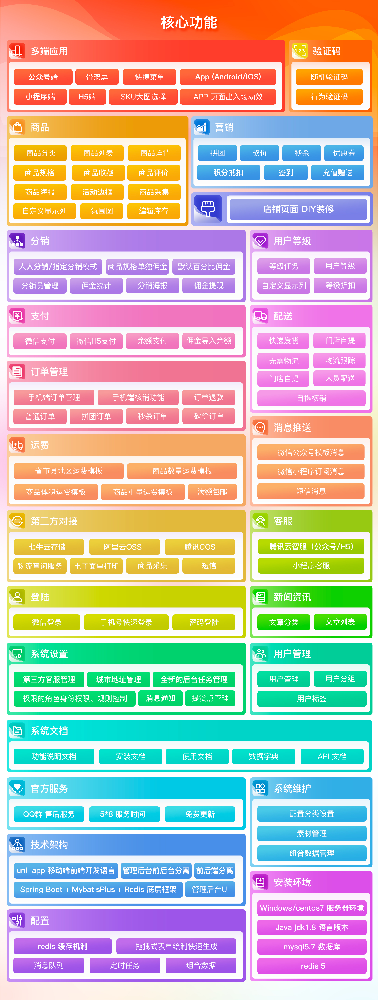

<div align="center">
    
</div>

<div align="center">

# CRMEB开源商城系统Java版

</div>

<div align="center">
    <a href="http://www.crmeb.com?from=giteejava">
        
    </a>
    <a href='https://gitee.com/ZhongBangKeJi/crmeb_java/members'>
        </img>
    </a>
    <a href='https://gitee.com/ZhongBangKeJi/crmeb_java/stargazers'>
        </img>
    </a>
</div>

<div align="center">

[官网](https://www.crmeb.com/?from=giteejava) |
[在线体验](https://admin.java.crmeb.net) |
[帮助文档](https://doc.crmeb.com/java/crmeb_java) |
[技术社区](https://www.crmeb.com/ask?from=giteejava) |
[主题广场](https://www.crmeb.com/theme) |
[宽屏预览](https://gitee.com/ZhongBangKeJi/crmeb_java/blob/master/README.md)

如果对您有帮助，您可以点右上角 "Star" ❤️ 支持一下 谢谢！

</div>

---

### 📖 项目介绍

CRMEB开源商城系统Java版，是一款基于Apache-2.0协议发布的开源电商解决方案。代码全开源无加密，可免费商用，适合各类企业及开发者快速构建多端一体化商城。

#### 技术架构
系统采用Java + Vue + uni-app技术栈，基于SpringBoot框架构建，前后端分离架构设计清晰。借助uni-app的跨端能力，轻松实现小程序、公众号、H5、APP、PC端全覆盖，数据统一、业务同步，极大提升开发与维护效率。同时，系统代码规范清晰，注释详尽，二次开发十分方便。

#### 核心功能
管理功能全面：包含商品管理（支持SKU、属性、分类、评价）、订单管理、用户管理、购物车、物流管理、财务统计、多种支付方式等。

#### 丰富的营销工具
10余种营销功能充分满足日常需求，包括拼团、砍价、秒杀、优惠券、签到、积分、等级会员、余额充值、分销裂变、活动边框、氛围图等，可灵活设置活动规则。

#### 可视化页面DIY装修
系统支持页面DIY设计，内置21种组件可自由拖拽设置，无需编码即可快速搭建个性化页面。

- **图片热区**：在一张图片中，为不同位置添加不同的跳转链接。
- **图片魔方**：一个组件，6种布局样式可选，能灵活满足使用需求。
- **导航跳转**：不仅能跳转商城内部页面，也能根据具体的运营环境跳转小程序、H5等。

每种组件都有多种样式可选，组件细节支持自由调整。

#### 主题广场

主题广场拥有丰富精美的商城模板，全面深度适配 CRMEB 开源商城系统，支持一键下载导入快速启用；多样化主题风格与配色方案可精准匹配不同行业、不同领域的应用需求，同时主题广场完全向CRMEB用户开放，鼓励开发者自主设计、导出并上架分享，与平台共建丰富多元、持续繁荣的 CRMEB 主题生态。立即前往：<a href="https://www.crmeb.com/theme" target="_blank">主题广场</a>


#### 社区共建计划
我们致力于打造开发者友好生态，开放源码、持续更新功能模块，并欢迎开发者提交优化建议或贡献代码。通过共享技术成果，降低行业重复造轮子成本，推动开源电商系统的可持续发展。

---

### ✨ 系统优势

- **成熟稳定的架构**：后端 SpringBoot + SpringSecurity，前端 Vue + ElementUI（PC管理端）与 uni-app（移动端），多端并行开发，结构清晰。
- **规范的接口设计**：提供规范的RESTful API与数据结构，接口复用率高，逻辑层次清晰，便于二次开发与系统集成。
- **数据与统计**：集成ECharts实现多维数据看板，支持订单、用户、资金等多维度统计分析，数据可导出，助力运营决策。
- **高效开发支持**：支持Vue表单拖拽生成，大幅减少前端重复工作，提升开发效率。
- **精细权限控制**：基于Spring Security实现角色权限控制，可精确到按钮级别，保障系统安全。
- **高可用设计**：内置Redis队列，有效削峰解耦，提升系统并发能力与稳定性。

---

### 🛠️ 技术栈与运行环境

| 类别 | 技术 |
|------|------|
| 后端框架 | SpringBoot 2.2.6.RELEASE |
| ORM | Mybatis Plus 3.3.1 |
| 数据库 | MySQL 8.0 |
| 缓存 | Redis |
| 构建工具 | Maven 3.6.1 |
| API文档 | swagger-bootstrap-ui 1.0 |
| PC管理端 | Vue 2.x + Element UI 2.13 |
| 移动端 | uni-app（H5 + 公众号 + 微信小程序） |
| 开发工具 | HbuilderX（移动端） |
| 运行环境 | Java 1.8、Node 14、npm 6 |
| 兼容性 | 主流浏览器（含 IE11+）、Linux / Windows |

---

### 📦 项目结构

```
crmeb_java
├── admin/          PC端管理端（Vue + ElementUI）
├── app/            移动商城（UniApp标准开发，支持H5 + 微信小程序）
├── crmeb/          后端API服务（Java SpringBoot + MybatisPlus）
└── 接口文档/        部署后也可在线查看 Swagger 文档
```

---

###  📖 系统功能



---

###  📖 UI界面展示


---

###  📖 后台界面展示


---


### 🚀 系统演示


**管理后台**：https://admin.java.crmeb.net  
账号：`demo` / 密码：`crmeb.com`

**H5 端**：https://java.crmeb.net

---

### 📚 项目资料

**文档资源**

| 文档 | 链接 |
|------|------|
| 使用文档 | https://doc.crmeb.com/java/crmeb_java/1868 |
| 接口文档 | https://s.apifox.cn/f6079100-abee-40fe-959d-846e44f1a048 |
| 数据字典 | https://doc.crmeb.com/java/crmeb_java/5410 |
| 二开文档 | https://doc.crmeb.com/java |
| 技术社区 | https://www.crmeb.com/ask/thread/list/152 |

**安装教程**

- 视频教程：[点击查看](https://www.bilibili.com/video/BV1MAiiY5EtP/?spm_id_from=333.1387.search.video.card.click&vd_source=9cea4dcdafd21c93762100c496e0f2a3)
- 安装步骤详解：https://doc.crmeb.com/java/crmeb_java/2154

---

### 💬 技术交流

欢迎加入CRMEB开源技术交流群，扫码进群免费领取接口文档、功能清单、思维导图等资源！


您还可以在 [CRMEB技术社区](https://www.crmeb.com/ask/thread/list/152) 中提交Bug、交流解决方案、获取官方更新动态。

> CRMEB开源商城PHP版：https://gitee.com/ZhongBangKeJi/CRMEB
